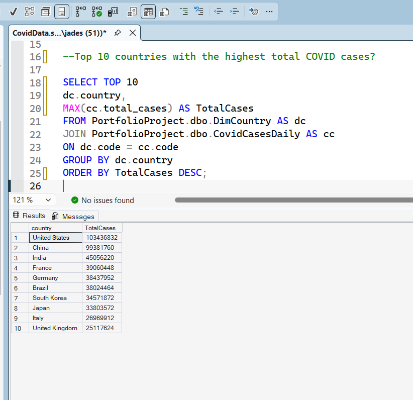
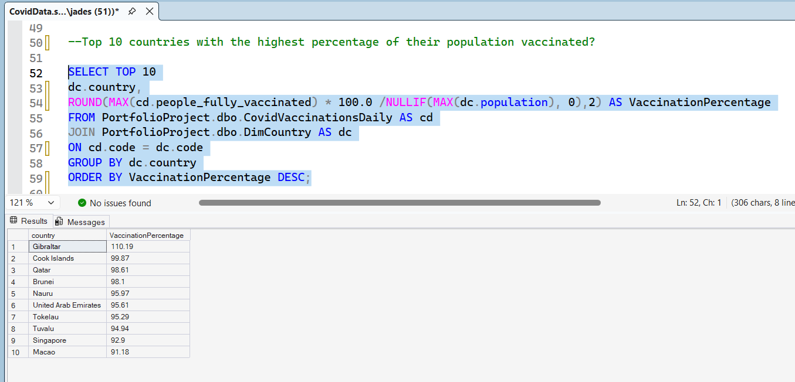
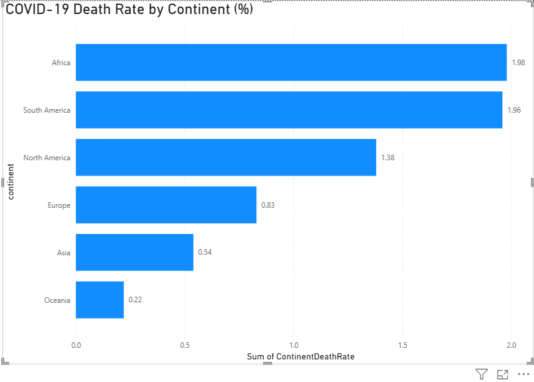
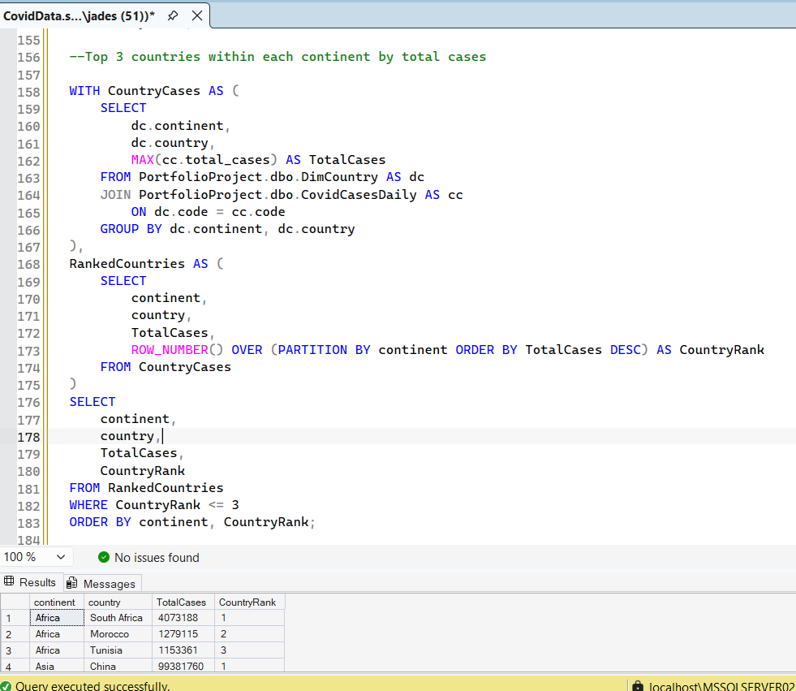

COVID-19 Data Analysis using SQL Server

📌 Introduction

This project analyses a global COVID-19 dataset using Microsoft SQL Server to uncover trends in cases, deaths, vaccination rates, and continent-level performance.

The analysis focuses on transforming raw COVID-19 data into meaningful insights through SQL querying, aggregation, ranking, and KPI calculations.

🎯 Project Objective

To analyse global COVID-19 trends using SQL Server by examining infection rates, mortality rates, vaccination coverage, and regional performance across countries and continents.

🔍 Full SQL script available in:
Covid19_SQL_Analysis.sql

📊 Background

The COVID-19 pandemic generated vast amounts of data across countries and continents. Understanding patterns in infections, deaths, and vaccination coverage requires more than simply querying data—it requires selecting the correct analytical approach and aggregations to produce reliable insights.

Using a dimensional data model consisting of country, case, and vaccination tables, this project explores key global COVID-19 trends.

❓ Business Questions Answered

How many countries are in the dataset?

What is the earliest and latest date available?

Which countries recorded the highest total COVID-19 cases?

Which countries recorded the highest total COVID-19 deaths?

Which countries had the highest COVID-19 death rates?

Which countries vaccinated the highest percentage of their population?

Which continent recorded the highest total COVID-19 cases?

Which continent recorded the highest death rate?

Which continent recorded the highest vaccination rate?

Which countries exceeded 1 million confirmed cases?

How do countries rank by total cases?

Which are the Top 3 countries within each continent by total cases?

🗂️ Dataset Structure

DimCountry
Contains:

Country
Continent
Population
GDP per Capita
Human Development Index

CovidCasesDaily
Contains:

Date
Total Cases
New Cases
Total Deaths
New Deaths

CovidVaccinationsDaily
Contains:

Total Vaccinations
People Vaccinated
People Fully Vaccinated

🛠️ SQL Skills Demonstrated:

INNER JOIN
Aggregate Functions (COUNT, MAX, SUM)
GROUP BY
HAVING
Subqueries
Common Table Expressions (CTEs)
Window Functions (ROW_NUMBER, RANK)
KPI Calculations
Data Modelling
Data Exploration

📈 Key Insights

### Top COVID-19 Cases

- United States recorded over 103 million confirmed cases, the highest in the dataset.
- China ranked second with approximately 99 million cases.
- India ranked third with approximately 45 million cases.

### Vaccination Coverage

- Gibraltar achieved the highest vaccination coverage at over 110%.
- Several smaller nations exceeded 90% vaccination coverage.
- Vaccination rates varied significantly across countries.

### Continent-Level Analysis

- Africa recorded the highest death rate (1.98%).
- South America followed closely at 1.96%.
- Oceania recorded the lowest death rate (0.22%).

🖼️ Sample Analysis Outputs

## Top 10 Countries by Total Cases

## Top 10 Countries by Vaccination Percentage

## Highest Death Rate by Continent

## Top 3 Countries Within Each Continent by Total Cases

💻 Tools Used
Microsoft SQL Server
SQL Server Management Studio (SSMS)
GitHub
PowerBI

📂 Repository Contents
Covid19_SQL_Analysis.sql
README.md
/images

🚀 Conclusion

This project demonstrates the use of SQL Server for exploratory analysis, KPI calculation, ranking, and continent-level reporting on global COVID-19 data.

Through joins, aggregations, subqueries, CTEs, and window functions, raw data was transformed into actionable insights that highlight infection trends, mortality rates, and vaccination coverage across countries and continents.

The project also demonstrates the integration of SQL and Power BI to communicate analytical findings through clear visualisations.
